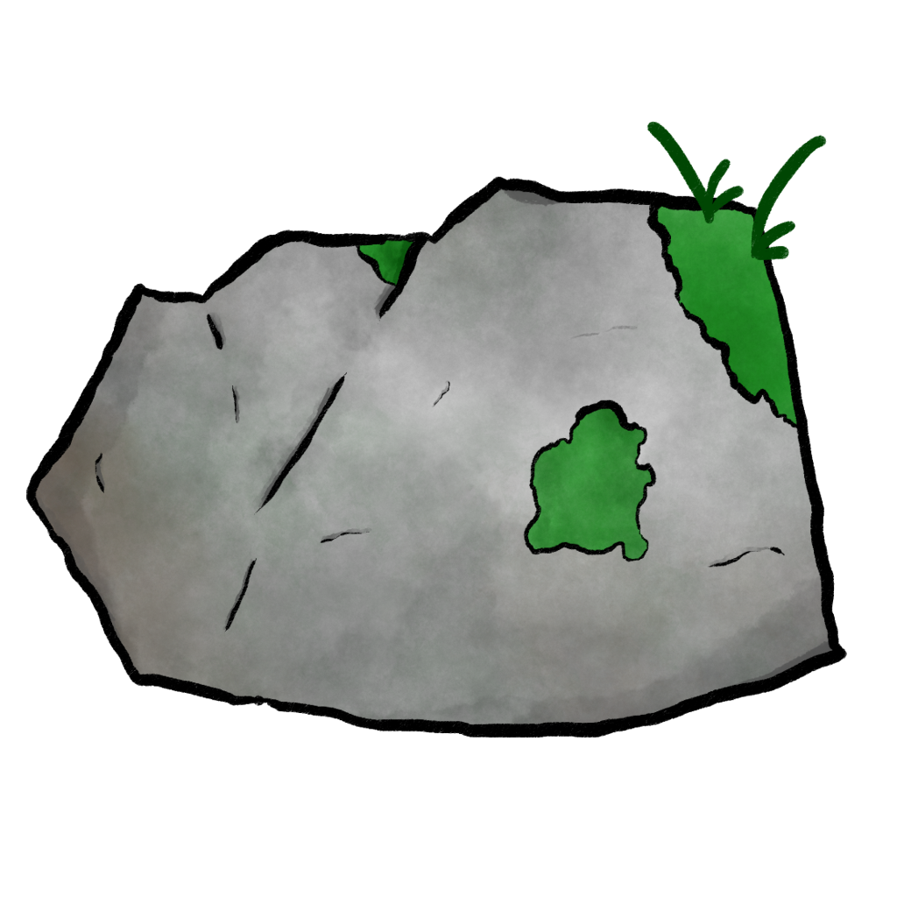
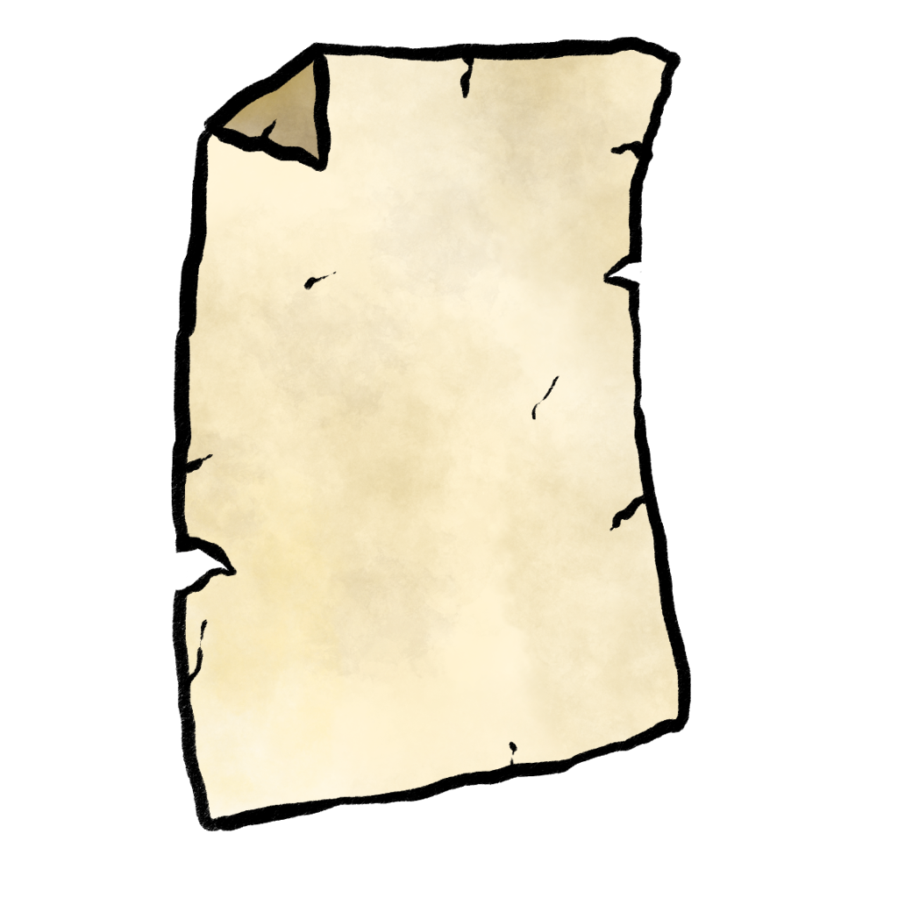
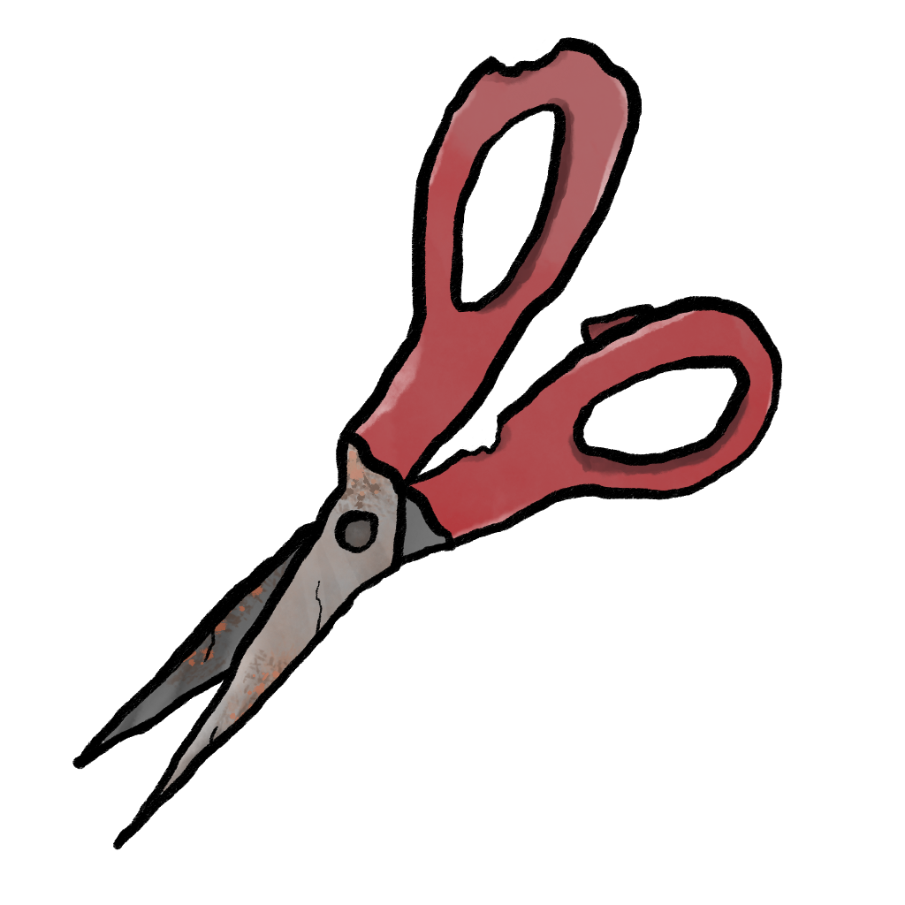

# Rock Paper Scissors

A web-based multiplayer application created as a learning exercise to build upon my web-development skills.

## What is it?

This app lets users play rock paper scissors with their friends by creating and joining game rooms. Once a game is created, that game dynamically appears for anyone else viewing the homepage of the application (no page reloading necessary).

To start, visit https://rps.andrewluther.ca/, and select "create game". Your new game will automatically be assigned a game-id which is a fun combination of a random adjective and noun (for example, "lethal-platypus"). This game room will appear for anyone viewing the homepage to join.

Once two players are inside of the same game room, the game will automatically begin! Players will be prompted to "Choose your weapon!" and can decide between rock, paper, or scissors. The options are visually displayed using images I created using a free open-source drawing program called [Krita](https://krita.org/en/):

  
  
  

Once both players have made a selection, an animation will be played showing what they selected and what the opponent selected. The result will be displayed, and then the players will have the option to continue playing again. Once both players leave the game room, the room is automatically removed from the server and a new one must be created.

## How/why was it made?

I created rock paper scissors purely as a learning exercise. I wanted a project to learn about client/server relationships in web applications, since most of my prior web development experience involved the development of static webpages.

As a result, I avoided using generative AI / LLMs during the development of this project. While I believe LLMs have their time and place in software development, this project was about learning, not just developing something as quickly as possible. Instead, I learned about the tech stack from my good friend and professional software developer [Jack](https://github.com/jackharrhy).

The project began as a barebones javascript application. The backend is a node [express](https://expressjs.com/) server which serves the frontend using websockets for back and forth communication. This allows for a seamless user experience both at the homepage and within the games. The server keeps track of all clients at each page of the application, and broadcasts relevant messages to users via websockets. For example, when a new game is created by one client, this information is delivered from that client to the server. Then, the server broadcasts a message to any other clients at the homepage with information about the new game. This message is then processed by the frontend to add it to the homepage without the user needing to reload their page. At the homepage this was a "nice to have" feature that was added later in development, but websockets were crucial for making the game part of the application functional. Users need to see game results in real time, without reloading the page.

When finishing up the project, I converted all javascript to typescript. To accomplish this, two new modules needed to be added to the project dependencies:

- [tsx](https://tsx.is/) allows the backend server code to be written in typescript by automatically converting it to javascript at runtime.

- [esbuild](https://esbuild.github.io/) allows the frontend code to be written in typescript by bundling it and outputting javascript files to the public folder, which are referenced by script tags in the HTML pages.

## How can I run it locally?

After installing [node](https://nodejs.org/en), all project dependencies (specified in [package.json](package.json)) may be installed using:

`npm install`

To host the project locally, run:

`npm run start`

As specified in [package.json](package.json), this command will use [concurrently](https://www.npmjs.com/package/concurrently) to both start the backend server using [tsx](https://tsx.is/) and bundle the frontend typescript with [esbuild](https://esbuild.github.io/). The application can then be viewed at localhost:3000. Using multiple tabs/windows will simulate multiple users. The `--watch` flag is added to all commands, so that local changes to the code are accounted for automatically.

## How are you hosting it?

Currently the project is running on my personal [digitalocean droplet](https://www.digitalocean.com/products/droplets). It is packaged using [docker](https://www.docker.com/), which runs the build using `npm run build` (bundles the frontend ts to js) and then `npm run prod` (runs the server).

The project is hosted at https://rps.andrewluther.ca/. For more information about how I host my projects online, check out https://github.com/AndrewLuther/infra.
